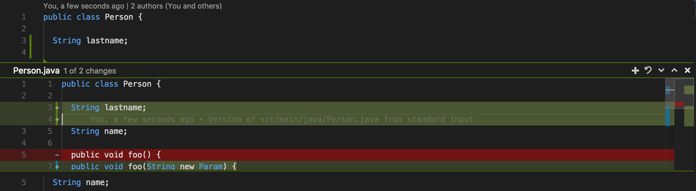
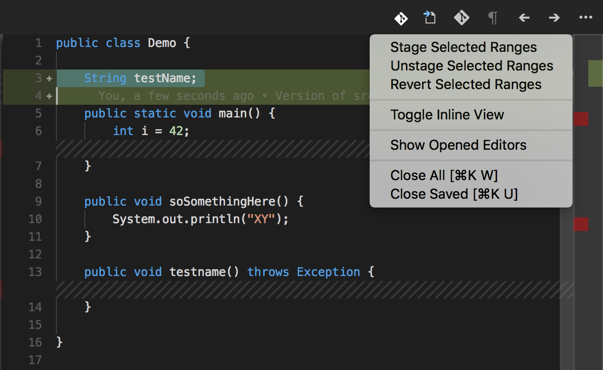

# GIT Playground Repository

This repository is used as GIT playground, contains no real content or project. But it contains a few hints in the readme on how to use GIT with visual studio code.

## Code as GIT Editor

Setup visual studio code as GIT editor.

		git config --global core.editor "code --wait"

## GIT Partial Commits

With `git add -p <file>` you can decide which changes in the file should be staged. 
In code this option is available in the editor (since October 2017 release) and in the diff editor.

### Stage one Change from Code Editor

Select on the left side in the editor the change and then stage the change via the plus button in the overlay:

### Stage Line or Change from Diff Editor

Go to the SCM view in code open the file in the diff viewer and select the lines which you like to stage. Select in the menu `...` and click on `Stage selected Range`.

## GIT Flow and Code

To use GIT Flow in Visual Studio Code there is a nice extension `GitFlow4Code` see:
https://github.com/shaggy13spe/gitflow4code/